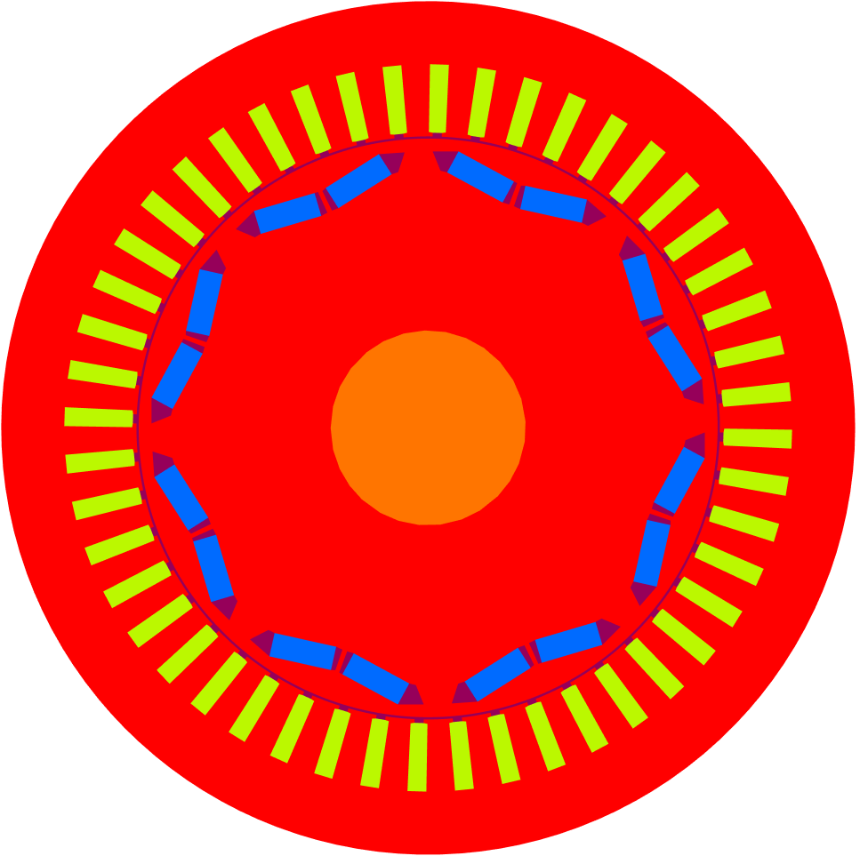

---
author:
- v1.0
bibliography:
- resources.bib
date: SoSe 2023
title: Seminar \"Simulation of electrical machines\"
---

Participants: Bogdan, Andreas, Mandlmayr, Peter, Herbert, Nepomuk,
Alessio, Michael, Felix, Stefan, Josef, Eva-Maria, ...

1.  Types of machines/motors: induction motor, permanent magnet motor,
    DC motor.

2.  Geometrie, Mesh (Andreas - \"Darmstadt\" permanent magnet machine,
    Nepomuk - Induction machine, Alessio - permanent magnet machine. For
    a DC motor, see Fig 1.5 in the book by Jung/Langer - FEM for
    engineers.)

3.  Nonlinear magnetostatics, material properties, energie,
    vector/scalar formulations

4.  Coupling over the air gap: mortaring (by using Lagrange multipliers
    (Josef is the expert here)), lock-step, sliding mesh. Multiple
    computations of magnetostatics for different angles $\alpha$.

5.  (cogging) Torque computation methods: virtual displacement,
    Maxwell-stress tensor, Arkkio's method, eggshell method. (Peter,
    Nepomuk, Alessio)

6.  Computing losses, THD (total harmonic distortion), Steinmetz(?),
    Eddy currents, Hysteresis.

7.  Efficiency improvements using symmetry, computing only a \"pizza\"
    slice. ...

# First project: Nonlinear Magnetostatics {#first-project-nonlinear-magnetostatics .unnumbered}

The goal for the first project is to compute the magnetostatic problem
for a \"real\" world problem. To this end, we will work with Alessio &
Peter's motor geometry of a permanent magnet machine, see
Figure [1](#fig:1){reference-type="ref" reference="fig:1"}.

For now, let $\Omega$ denote the computational domain. Then Maxwell's
equations for magnetostatics are described by: $$\begin{aligned}
{2}
\operatorname{curl}h &= j, \qquad && \text{in } \Omega, \label{eq:1}\\
\operatorname{div}b &= 0, \qquad && \text{in } \Omega, \label{eq:2}\\
n \cdot b &= 0, \qquad && \text{on } \partial\Omega, \label{eq:3}
\end{aligned}$$ On simply connected domains,
[\[eq:2\]](#eq:2){reference-type="eqref" reference="eq:2"} implies the
existence of a vector potential $a$ such that $$\begin{aligned}
    \operatorname{curl}a &= b\label{eq:4}
\end{aligned}$$ So far, these equations are independent of the
materials. To incorporate material properties, we need to introduce
constitutive equations, which will be different depending on the
material type, such as air, iron, or magnet. For now, assume that the
magnetic field $h$ and magnetic flux $b$ are linked by $$\begin{aligned}
    h = f'(b) \label{eq:nl}
\end{aligned}$$ where $f$ denotes a smooth and strongly convex \"energy
density\" $f: \mathbb{R}^d \to \mathbb{R}$. Using this relation, we can
write [\[eq:1\]](#eq:1){reference-type="eqref"
reference="eq:1"}--[\[eq:4\]](#eq:4){reference-type="eqref"
reference="eq:4"} in a compact manner in the following way:
$$\begin{aligned}
    \operatorname{curl}(f'(\operatorname{curl}a)) &= j + \operatorname{curl}m \\
    n\cdot \operatorname{curl}a &=0
\end{aligned}$$ In 2D, we can make the following simplifications: In the
typical setting with cylindrical symmetry, which is of relevance for
electric motors, one has $\Omega = \Omega_{2D} \times (0,L)$ and assumes
that $j=(0,0,j_3)$, $m=(m_1,m_2,0)$, $a=(0,0,a_3)$, $b=(b_1,b_2,0)$, and
$h=(h_1,h_2,0)$, with all components independent of $z$. In this way,
one arrives at the scalar problem $$\begin{aligned}
{2}
\operatorname{Curl}_{2D} f'(\operatorname{curl}_{2D} a_3) &= j_3 + \operatorname{Curl}_{2D} m, \qquad && \text{in } \Omega_{2D}, \\
n \cdot \operatorname{curl}_{2D} a_3 &= 0, \qquad && \text{on } \partial\Omega_{2D}.
\end{aligned}$$ Here
$\operatorname{Curl}_{2D}=(-\partial_y, \partial_x)$ and
$\operatorname{curl}_{2D}=\binom{\partial_y}{-\partial_x}$ are the
vector-to-scalar and scalar-to-vector curl, respectively. This problem
can further be transformed into $$\begin{aligned}
{2}
-\operatorname{div}(g'(\nabla u)) &= j_3 + \operatorname{div}m^\perp :=\widehat j_3, \qquad &&\text{in } \Omega_{2D} \label{eq:sys1} \\
u &= 0, \qquad && \text{on } \partial\Omega_{2D} \label{eq:sys2}
\end{aligned}$$ where now $u=a_3$ is the $z$-component of the vector
potential, $\binom{-b_2}{b_1}=\nabla u$ is the rotated magnetic flux,
$\binom{-h_2}{h_1}=g'(\nabla u)$ is the rotated magnetic field, and
$m^\perp = \binom{-m_2}{m_1}$ is the rotated magnetization.

**Herbert's note during our first meeting:** The boundary condition for
the transformed problem reads $\partial_t u := t\cdot\nabla u=0$,
meaning that the tangential component of $u$ vanishes on the whole
boundary. This, in turn, means that $u$ has to be constant on the
boundary. For this reason, we may set $u=0$ on $\partial\Omega$.
Careful! If the domain is not simply connected, we are not allowed to
prescribe $u$ everywhere on the boundary!

# Geometry specifications {#geometry-specifications .unnumbered}

Let us describe the exact geometry of the motor, see
Figure [1](#fig:1){reference-type="ref" reference="fig:1"}. The motor,
fully contained in the domain $\Omega\subset\mathbb{R}^2$, is comprised
of several materials, such as

-   16 permanent magnets
    $\Omega_M = \bigcup\limits_{i=1}^{16} \Omega_{M_i}$, depicted by the
    blue areas in Figure [1](#fig:1){reference-type="ref"
    reference="fig:1"}.

-   48 coils(aka \"slots\")
    $\Omega_C = \bigcup\limits_{i=1}^{48} \Omega_{C_i}$, depicted by the
    green/yellow(ish) areas in Figure [1](#fig:1){reference-type="ref"
    reference="fig:1"}

-   The iron stator $\Omega_{\text{S}}$, iron rotor $\Omega_{\text{R}}$
    (red areas), and the iron shaft $\Omega_{\text{SH}}$ (orange area)

-   Several air regions:

    -   48 air gap regions located below the coils
        $\Omega_{\text{AC}_i}$

    -   32 air gap regions $\Omega_{\text{AM}_i}$, 2 around each of the
        16 magnets\
        (visible in Figure [1](#fig:1){reference-type="ref"
        reference="fig:1"}, depicted by the purple areas)

    -   3 air gap regions between stator and rotor
        $\Omega_{\text{AG}_i}$

Go to <https://www.radubogdan.de/fem/motor.html> if you wish to look at
the geometry (and the mesh) in more detail.

<figure id="fig:1">

<figcaption>Geometry of the motor</figcaption>
</figure>

# Material laws and currents {#material-laws-and-currents .unnumbered}

Depending on the materials described above, different material laws
linking the magnetic field $h$ and magnetic flux $b$ have to be given.

-   For each of the coils $\Omega_{C_i}$, we have a linear material law
    given by $$\begin{aligned}
            h = \nu_0b \label{eq:6}
        
    \end{aligned}$$ Here $\nu_0$ is the magnetic reluctivity of the
    vacuum and is set to $$\begin{aligned}
    \label{eq:nu0}
            \nu_0 = 10^7/(4\pi)\frac{Vs}{Am} % \quad [\nu_0] = \left[\frac{kg\cdot m}{s^2A^2}\right]
        
    \end{aligned}$$ Moreover, on each $\Omega_{C_i}$, we prescribe a
    constant, scalar-valued current $(j_3)_i$. Again, the exact values
    can be extracted from the repository. For example, on the first coil
    $\Omega_{C_1}$, we have $$\begin{aligned}
            (j_3)_1 \approx 2.47\cdot 10^6 \frac{A}{m^2}
        
    \end{aligned}$$\
    **Sidenote:** The values for $(j_3)_i$ will change in the future for
    the torque computation, this should be easily adapted within the
    code.

-   For each permanent magnet $\Omega_{M_i}$ we have a linear material
    law given by $$\begin{aligned}
            h = \nu_{\text{mag}}b-m_i \label{eq:5}
        
    \end{aligned}$$ where $m_i$ is a vector field describing the
    orientation of the magnet, [@Stratton1941 Sec. 1.6], and
    $\nu_{\text{mag}}=\nu_0/1.086$. Here, on each $\Omega_{M_i}$, $m_i$
    is a constant vector field pointing either to or away from the
    shaft, depending on the orientation. For example, on the first
    magnet $\Omega_{M_1}$, we have $$\begin{aligned}
            m_1 \approx \binom{0.86}{0.51}\frac{A}{m}
        
    \end{aligned}$$ An exact list of values can be found in the
    repository.

-   For the iron stator $\Omega_{S}$ and iron rotor $\Omega_{R}$, the
    relation is given by $$\begin{aligned}
    {2}
        h = \nu(|b|)b, \label{eq:7}
        
    \end{aligned}$$ which is a non-linear relation, in general. The
    model we use is the Brauer model, where the relation is fixed by
    setting $\nu(|b|) = k_1e^{k_2|b|^2}+k_3$. Assuming both stator and
    rotor are made of cast iron, the constants are given by
    $$\begin{aligned}
            k_1 = 49.4,\quad k_2 = 1.46,\quad k_3 = 520.6,
        
    \end{aligned}$$ see [@Brauer1975] for this and other values. The
    iron shaft $\Omega_{\text{SH}}$ is supposed to be made up of
    non-conductive material. For this reason, the iron shaft is governed
    by the linear law $$\begin{aligned}
    {2}
        h = \nu_0b, \label{eq:8}
        
    \end{aligned}$$

-   For each of the air gaps $\Omega_{\text{AC}_i}$,
    $\Omega_{\text{AM}_i}$ and $\Omega_{\text{AG}_i}$, we again have
    non-conductivity, which is prescribed by the linear relation
    $$\begin{aligned}
            h = \nu_0b \label{eq:9}
        
    \end{aligned}$$

Check Peter's thesis [@Gangl2017 Chapter 2] for a more comprehensive
description.

# Solving the non-linear problem : Linearization {#solving-the-non-linear-problem-linearization .unnumbered}

The variational formulation of
[\[eq:sys1\]](#eq:sys1){reference-type="eqref"
reference="eq:sys1"}--[\[eq:sys2\]](#eq:sys2){reference-type="eqref"
reference="eq:sys2"} (using penalization for the Dirichlet condition)
leads to:\
Find $u\in H^1(\Omega)$ such that $$\begin{aligned}
(g'(\nabla u),\nabla v) + (\gamma u,v)_{\partial\Omega} = (\widehat j_3,v),\qquad\forall v\in H^1(\Omega)
\end{aligned}$$ for a large penalization parameter $\gamma$. We
linearize the first term in $u=\bar u + w$ in the following way:
$$\begin{aligned}
(g'(\nabla u),\nabla v) = (g'(\nabla (\bar u + w)),\nabla v) \approx (g'(\nabla \bar u),\nabla v) + (g''(\nabla \bar u)\nabla w,\nabla v) + O(|\nabla w|^2)
\end{aligned}$$ Plugging this second-order approximation into the
equation yields a linear system for the update $w$: $$\begin{aligned}
(g''(\nabla \bar u)\nabla w,\nabla v) + (\gamma w,v)_{\partial\Omega} = (\widehat j_3,v)-(\gamma \bar u,v)_{\partial\Omega}-(g'(\nabla \bar u),\nabla v) 
\end{aligned}$$ Then $u_{\text{new}} = \bar u + \alpha w$ where $\alpha$
is a line search parameter that can be determined by a residual-based or
an objective-based method, where the objective is given by the energy
functional $$\begin{aligned}
J(u):=\int_\Omega g(\nabla u)-\widehat j_3 u -\frac12\int_{\partial\Omega}\gamma |u|^2
\end{aligned}$$ For more info, consult our optimization expert Dr.
Mandlmayr.

# The repository {#the-repository .unnumbered}

The geometry information and the exact values of the right-hand sides
are given in the repository <https://github.com/radu-bogdan/SeminarEM>
and are available for either [Python]{.smallcaps}, [Matlab]{.smallcaps}
or [ngsolve]{.smallcaps}.

Here you will find the \"classic\" `{p,e,t}` format, comprised of a list
of points, a list of (phyiscal) edges, and a list of triangles. The last
row of `e` and `t` assigns to each (physical) edge and triangle a
numerical region, respectively.

You can also find a list of strings `regions_2d` and `regions_1d` which
assign a description to each numerical region value. Let us briefly
detail how the regions and the subdomains described above are linked.

-   The magnets $\Omega_{M_i}$ are denoted by `magnet#i`

-   The coils $\Omega_{C_i}$ are denoted by `coil#i`

-   The iron stator $\Omega_{S}$ and iron rotor $\Omega_{R}$ are denoted
    by `stator_iron` and `rotor_iron`, respectively

-   The air gaps $\Omega_{\text{AC}_i}$ are all denoted by `air`, the
    air gaps $\Omega_{\text{AM}_i}$ are denoted by `rotor_air`; The $3$
    air gap layers between stator and rotor $\Omega_{\text{AG}_i}$ are
    denoted by `air_gap_stator, air_gap` and `air_gap_rotor`.

You will also find a vector `j3` and a matrix `m` detailing the exact
values of the current in the coils and the magnetization values, which
are both assumed to be piece-wise constant.

# Questions? Found any mistakes? {#questions-found-any-mistakes .unnumbered}

Come to my office, you know where to find me!

# Goals for the first one/two weeks {#goals-for-the-first-onetwo-weeks .unnumbered}

-   Implement the magnetostatic problem in 2D using the programming tool
    of your choice

-   Implement the problem using first and second-order elements, check
    convergence rates. Check number of Newton iterations needed.
    Pro-tip: this should be fast!; later we want to compute multiple
    magnetostatic problems corresponding to different rotation angles
    for the torque computation.

-   If there is time, also implement the magnetic scalar potential.
    Careful: we now require the inverse of the non-linear relation!
